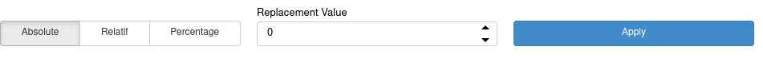
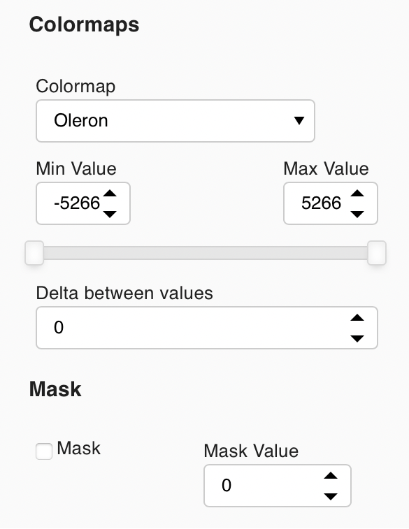

## Introduction
{:.no_toc}
The NetCDF Editor App is maintained by [CEREGE-CL](https://github.com/CEREGE-CL). The goal of the app is to be able to interactively visualize and adjust netcdf files for use for deep time simulations.


## Table of Contents
{:.no_toc}
1. TOC
{:toc}

## Interface

### Browse

The entrypoint to the app is to upload a file using the available upload tool, seen below.


<p style="background-color: rgb(160, 194, 217);padding-left: 30px;">
Currently Google Cloud only accept files less than roughly 20mb, however the limit for local deployement has been set to 100mb and is modifiable.
</p>

Under the hood the import and manipulation of the netCDF files is done by [xarray](https://xarray.pydata.org/en/stable/). 

```python
import xarray as xr
data = xr.open_dataset(FILENAME)
```

#### Curvilinear Coordinates

Curvilinear coordinates are supported __HOWEVER__ they are reprojected into _ij_ space. This is done because calculating selections on a non uniform grid is costly. Below the curvilinear grid is on the left, notice the areas in black that were not initially covered.


### Options

#### Graph tools

Above the graphs on the upper right hand side are a collections of tools, from left to right these are:
- Box selection
- Lasso selection
- Pan
- Box Zoom
- Mouse Scroll
- Save images
- Refresh / reset all graphs to initial zoom
- Hover

<p style="background-color: rgb(160, 194, 217);padding-left: 30px;">
Long holding either type of selection tool allows the user to change the selection type (union, intersection, ...)
</p>

<p style="background-color: rgb(160, 194, 217);padding-left: 30px;">
Selections on multiple graphs are the intersection of the selections.

This can be useful for when editing specific values in a region using a combination of map + histogram selection
</p>

<p style="background-color: rgb(160, 194, 217);padding-left: 30px;">
Prefer Box selection(s) where possible as the calculations for the selections are quicker
</p>

#### Apply new values



After point(s) have been selected on the graphs the user has the possibility to change the values in the underlying netcdf file. Three methods have been implemented:

- __Absolute__: The value for all points are set the the given value
- __Relatif__: The values for all points are increased (or decreased) by the replacement value
- __Percentage__: The values for all points are increased (or decreased) by the _x_ percent

#### Colormap



At the top we can choose the variable in this case _Z_.

Next we can choose the colormap and the min and max values of the colormap. Anything below the minimum value will appear light gray and anything above the maximum value will appear black.

Next we can choose the number of color steps in the colormap.
<p style="background-color: rgb(160, 194, 217);padding-left: 30px;">
If set to 1 the colormap is continuous
</p>


Finally we can choose to use a mask, this colors values below the cutoff to gray and above the cutoff to black. 

<p style="background-color: rgb(160, 194, 217);padding-left: 30px;">
This is the same as setting the min and max colormap values to the same value
</p>

### Extra Maps


Finally we can choose to show extra maps. These carry out useful calculations to show locations that could cause a problem.

#### Internal Oceans

The simulation code has problems when internal oceans are present. Internal oceans are defined by values of 0 or less surrounded by values of land. By checking this option the backend will calculate in the current configuration the number of internal oceans and their locations.


#### Diffusive passages

Due to the way that the simulation code is written water passages (value of 0 or less) with a width of one cell will only have diffusive properties and no advection, whilst this may be desired in certain locations this can be undesirable in certain areas (Strait of Gibraltar, Panama, ... ). By checking this option the backend will calculate in the current configuration the number of diffusive oceanic cells and their locations.


<p align="center">
  
</p>

##### Theory

Convolutions were used to determine the diffusive passages.

The template that was used was the following and it's Transpose:

<table style="border: white;">
<tr style="border: white;">
    <td style="background-color: rgb(205, 205, 205);border: none;">?</td>
    <td style="background-color: rgb(160, 194, 217);border: none;">Water</td>
    <td style="background-color: rgb(205, 205, 205);border: none;">?</td>
    <td style="border: none;"></td>
    <td style="background-color: rgb(205, 205, 205);border: none;">0</td>
    <td style="background-color: rgb(160, 194, 217);border: none;">1</td>
    <td style="background-color: rgb(205, 205, 205);border: none;">0</td>
</tr>
<tr style="border: white;">
    <td style="background-color: rgb(171, 148, 114);border: none;">Land</td>
    <td style="background-color: rgb(160, 194, 217);border: none;">Water</td>
    <td style="background-color: rgb(171, 148, 114);border: none;">Land</td>
    <td style="border: none;"></td>
    <td style="background-color: rgb(171, 148, 114);border: none;">-1</td>
    <td style="background-color: rgb(160, 194, 217);border: none;">1</td>
    <td style="background-color: rgb(171, 148, 114);border: none;">-1</td>
</tr>
<tr style="border: white;">
    <td style="background-color: rgb(205, 205, 205);border: none;">?</td>
    <td style="background-color: rgb(160, 194, 217);border: none;">Water</td>
    <td style="background-color: rgb(205, 205, 205);border: none;">?</td>
    <td style="border: none;"></td>
    <td style="background-color: rgb(205, 205, 205);border: none;">0</td>
    <td style="background-color: rgb(160, 194, 217);border: none;">1</td>
    <td style="background-color: rgb(205, 205, 205);border: none;">0</td>
</tr>
</table>

A convolution works by passing a moving window over the underlying array and multiplying each value of the base array with the value in the template, it then calculates the sum and assigns it to the center cell. 

By coding in the template and the base array:
- Land -> -1 
- Ocean -> 1

It is possible to use 0 as values that we do not care about hence the templates above.

## Deployements


### Local
The repository is setup to be able to run on local hardware (user's laptop or on premise cloud). To run locally simply clone this repository and run:

```docker-compose -f "docker-compose.yml" up --build```

### Cloud

#### [Heroku](https://netcdf-editor-app.herokuapp.com)

[](https://netcdf-editor-app.herokuapp.com)

Heroku is a free service that is automatically deployed from the github repo when the `main` branch is updated. 

Being a free service ressource are limited and the app is laggy. This is maybe the best way to get a gist of what is happening but not useful for carrying out work. 

You can test the app [here](https://netcdf-editor-app.herokuapp.com)

#### [Google Cloud](https://netcdf-editor.ew.r.appspot.com/app)

We are testing using Google Cloud (Google App Engine) to build and run the App. In the same manner a trigger has been setup so that when `main` is updated a build and deployment occurs automatically.

Currently the App is running on free credits, however when these credits run out we have to decide if we carry on using this service or not.

You can test the app [here](https://netcdf-editor.ew.r.appspot.com/app)