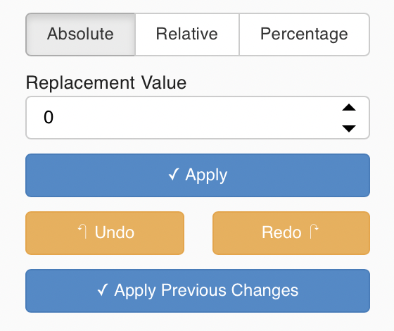

# Interact with data

    This section shows how to use the features of the panel dashboard. It is used by the <a href="/netcdf_editor_app/single">Single page web app</a> and the <a href="/netcdf_editor_app/multi#internal-oceans">Internal Oceans</a>, <a href="/netcdf_editor_app/multi#passage-problems">Passage Problems</a> and <a href="/netcdf_editor_app/multi#sub-basins">Sub basins</a> steps of the <a href="/netcdf_editor_app/multi">Multi page web app</a>. 

    

Variable to display can be selected at the top of the *left panel* in **Variable** section.

## Colormap

Options on colormap can be set in the *left panel* in **Colormaps** section.

    

Min and max values can be defined. Anything below the minimum value will appear light gray and anything above the maximum value will appear black.

Next, the number of color steps in the colormap can be also set.

    If set to 1 the colormap is continuous

Finally a mask can be applied, this colors values below the cutoff to gray and above the cutoff to black. 

    This is the same as setting the min and max colormap values to the same value

## Graph tools

    

At the top right corner of the *figure panel* are a collections of tools, from left to right these are:

- Box selection
- Lasso selection
- Pan
- Box Zoom
- Mouse Scroll
- Save images
- Refresh / reset all graphs to initial zoom
- Hover (Display information when hovering data with the mouse)

## Selection

As mentioned, in order to change the values of the data, the user can select data in two different ways:

- lasso tool (hand-drawn area)
- box selection (squared area)

    Long holding either type of selection tool allows the user to change the selection type (union, intersection, ...).

    
    

    Selections on multiple graphs are the intersection of the selections.
    This can be useful for when editing specific values in a region using a combination of map + histogram selection.

    Prefer Box selection(s) where possible as the calculations for the selections are quicker.

Then selection can be refined by ticking/unticking boxes in the **Change Values** section in the *left panel*:

    

## Apply new values

    

After point(s) have been selected on the graphs the user has the possibility to change the values in three different ways by using buttons in the **Change Values** section in the *left panel*.

If we consider the value in the **Replacement Value** field = `X_value`:

- Absolute (`New_value = X_value`)
- Relative (`New_value = base_value + X_value`)
- Percentage (`New_value = base_value + base_value * X_value %` ➞ `X_value` in **Replacement Value** field refers to a percentage)

Apply button can then be clicked to confirm changes. User can also choose to **Undo** or **Redo** changes he has made.

## Save

Once all the changes have been done, the **Save** button can be clicked at the bottom of the *figure panel* to confirm changes and return to the main page.

