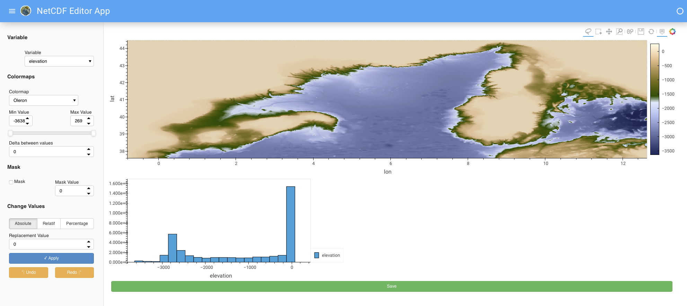

## Introduction
{:.no_toc}
As more and more tools were being added to the single page web app the workflow outgrew the scope of a single page web app. A full web app was built to handle this task.

### Preprocessing
{:.no_toc}
The Web tool allows a certain number of steps needed to create the boundary conditions for climate simulation models, notably IPSL.

## Table of Contents
{:.no_toc}
1. TOC
{:toc}

## Usage

We are greated with a login page. If this is the first time you are connecting (or the database has been reset) then you will first need to register (There are no constraints on username + password -> eg. you can write 1 letter usernames and passwords and also clobber previous entries). This step mainly exists to allow separating files based off from the UI in the future.

Once logged in we can see (all) files on the server that have already been added and also the possibility to upload a new file (top right). Files are order by last modified.

To upload a new file simply:
1. click the upload button
1. Choose the file
1. Click Submit
1. Set the longitude and latitude fields (used by several internal apps to get coordinates)

Once finished the file name should appear at the top of the list.

Inside a data file we can see it is separeted into two parts:
- Workflow
- Assets

The workflow has links through to the different steps that can be carried out. By default they have a <i class="fas fa-times-circle" style="color:#FF4136"></i> this means that the step is out of sync or has not been carried out.

When processing steps will have a <i class="fas fa-cog fa-spin" style="color:#377ba8"></i> and when completed a <i class="fas fa-check-square" style="color:#2ECC40"></i>. Note that if you update a prior step dependant steps are automatically carried out and the state is updated automatically, see image below. Certains steps notably [panel steps](#panel) can not be automatically updated and will be given a <i class="fas fa-times-circle" style="color:#FF4136"></i> to show they are no longer in sync.

[](https://mermaid-js.github.io/mermaid-live-editor/#/edit/eyJjb2RlIjoiZ3JhcGggVERcbiAgICBBKFJhdykgLS0-IEIoUmVncmlkKVxuICAgIEIgLS0-IHwgUmF3IHxDKEludGVybmFsIE9jZWFucylcbiAgICBDIC0tPiB8IFJhdyB8IEQoUm91dGluZylcbiAgICBEIC0tPiB8IFRvcG8gfCBFKFBGVClcbiAgICBEIC0tPiB8IEJhdGh5IHwgRihQYXNzYWdlIFByb2JsZW1zKVxuICAgIEYgLS0-IHwgQmF0aHkgfCBIKEhlYXRmbG93KVxuICAgIEYgLS0-IHwgQmF0aHkgfCBHKFN1YmJhc2lucylcbiAgICBGIC0tPiB8IEJhdGh5IHwgSShBSE1Db2VmKVxuICAgIEcgLS0-IHwgU3ViIGJhc2lucyB8IEooQ2FsY3VsYXRlIFdlaWdodHMpXG4gICAgRCAtLT4gSyhUb3BvIEhpZ2ggUmVzKVxuICAgIEQgLS0-IEwoU29pbHMpXG4gICAgRCAtLT4gTShSb3V0aW5nKSIsIm1lcm1haWQiOnsidGhlbWUiOiJuZXV0cmFsIn0sInVwZGF0ZUVkaXRvciI6ZmFsc2V9)

The assests table show the currently availible files. You can download them by clicking the download button. The view button will give a basic overview of the file. The complex viewer opens the panel app allowing you to change values inside the file. The Revision comparison does a diff and show this to the previous version of the same file.

## Architecture

The App is composed of a multitude of components that interact together. Each microservice has its own task. All the different services can be found in `Multi_Page_WebApp/services`

    Currently a database exists but is not a separate service.

### Database

This is not a service (container by itself) but shared (via a volume) between the different containers. The Data base currently holds 4 tables:
- User: Stores username + password
- data_files this is the base table that is used for url endpoints on each upload a new id is given. It stores the uploded filename as well as some basic metadata info mainly the longitude and latitutde coordinates.
- revisions: Holds the different revision data and file types that have been seen. Each time a processing step is finished a new file is saved. The file has a file type (these can be seen in assets) and a revision number. We store filepath (all files are saved in the `instance` folder) rather than the netcdf file in a binary format -> this means we can accidently delete files and become out of sync.
- steps: used to store the different processing steps and the options that were used to run the task.

### Flask

[Flask](https://flask.palletsprojects.com/en/1.1.x/) is a python library that is used to create multipage web apps. It handles the routing (different endpoints) and requests. Being in written in python it can execute python code before rendering HTML templates written in `jinja` template language. 

The main goal of this container is to display the different webpages, do simple computations used for visualisations and handle requests.

### Panel

[Panel](http://panel.holoviz.org/) is a dashboarding technology for python. It is the tool that is used to create the single page app. It is useful for creating rich in page interactivity and processing easily.

The single page webapp has been slightly refactored and then reused notably for:
- Internal Oceans
- Passage Problems
- Sub basins
- Complex Viewer (The complex viewer is a port of the single page web app and can be used to quickly and easily modify any file)

The source code for these fiels are in `Multi_Page_WebApp/netcdf_editor_app/holoviews`

Pro Tip: If you want to modify a file simply upload as usual (the workflow doesnt expect anything in particular for Raw files) and then you can edit it.

After saving the revision count will grow by one and you can download the file.

### Nginx

Nginx is a reverse proxy this is used to dispatch requests between flask and panel containers.

This is also the only entry point (open endpoint) to the app as the containers "collaborate" on an internal network. 

We have also:
- Boosted the timeout to 1d → This is to support the case of blocking a webpage during a long process
- Set upload size to 200Mb (this can be made bigger if needed)

### RabbitMQ

[Rabbit](https://www.rabbitmq.com) is a messaging broker, we can setup multiple queue which store "tasks" from the UI (flask app or other) then interprete these. 

Being the message broker this is where all the messages are stored and where the consumers connect to.

    For more information see <a href='#messaging'> Messaging </a> for more info.

### Message Dispatcher

In messaging terms this is a consumer. To decouple the UI from the implementation we use this service. For example the interface may say something like `regrid this` the message dispatcher interprets this message then dispatches it to the correct queue, this also means we can change backend calculations seamlessly from the frontend, in this example regridding is carried out in python so the dispatcher will send the appropriate message to the python task queue. __This is very important because it allows executing code in different environments, Python, Fortran ....__

Another key feature of the message dispatcher is that it receives `*.done` messages, effectively the processing jobs saying I have finished processing this task. With these messages it looks in `constants.py` to see if this step invalidates other steps and sends the message to the appropriate queue. This is very important because it means __we can create processing pipeline and dynamically update files when previous steps are carried out!__

    For more information see <a href='#messaging'> Messaging </a> for more info.

### Python Worker

The python worker holds a collection of algorithms written in Python. The algorithms can be found in `Multi_Page_WebApp/netcd_editor_app/utils` and have been decoupled from the interface meaning they can be executed separetly (outside of the App).

Routines include:
- geothermal heatflow calculations according to Fred Fluteau script
- PFT file creation
- Routing file calculations following a modification of Jean-Baptise Ladants code
- ahmcoeff (used to augment ocean flow)

We can easily scale workers with `--scale python_worker=X` to create multiple instances and carry out compute in parallel.

## Messaging

It was decided to use a messaging queue to facilate (processing) communications between containers.

The basic workflow is:
1. UI sends a message to carry out a task.
1. Message Dispatcher receives the message and sends it to the correct task queue currently:
    - Python
    - Fortran
    - Panel
1. A worker picks up the task and carrys out the process
1. When done the worker sends a message to the dispactcher saying it has finished
1. The dispatcher looks to see if any other steps depend on this step and send a message -> Go to step 2
1. Processing stops when all steps have finished and the dispatcher does not send out any new messages

Advantages of this implementations are:
- Pipeline calculations (see above)
- Steps can be run in parallel
- Steps can be run in different enviroments -> a consumer can be written in any language we simply need to tell the dispatcher that these messages should be sent to a given queue

# After

## Installation

The installation process uses Docker and docker-compose so ensure that they are installed first.

1. Clone this repository and check out the appropriate brach (unless reason to change you probably want main). `git clone https://github.com/CEREGE-CL/netcdf_editor_app.git`
1. Change into the directory `cd netcdf-editor-app`
1. Make sure nothing is running `docker-compose -f docker-compose.yaml --env-file ./config/.env.prod down`
1. Make sure it is up to date `git reset --hard @{u}` (resets to latest changes on repo)
1. If there has been a database upgrade you will need to delete the docker volume associated you can see docker volumes with `docker volume ls` either delete the volume with `docker volume rm netcdf_editor_app_instance_storage` or run `docker volume prune` to remove all volumes of stopped containers.
1. Run `docker-compose -f docker-compose.yaml --env-file ./config/.env.prod up --build -d --scale python_worker=3` to start the containers (lots of info will occur here but dont be scared!).Everything is ready when you see `[X] waiting for messages` in the terminal. `--scale python_worker=3` means we start 3 python_workers to carry out tasks in parallel. 
1. If this is the first time running the database then you will need to initialize it with the following command `docker exec -it netcdf_editor_app_flask_app_1 python -m flask init-db`
1. Navigate to `http://localhost:43829` the port is defined in `config/.env.prod` under `NGINX_PORT`