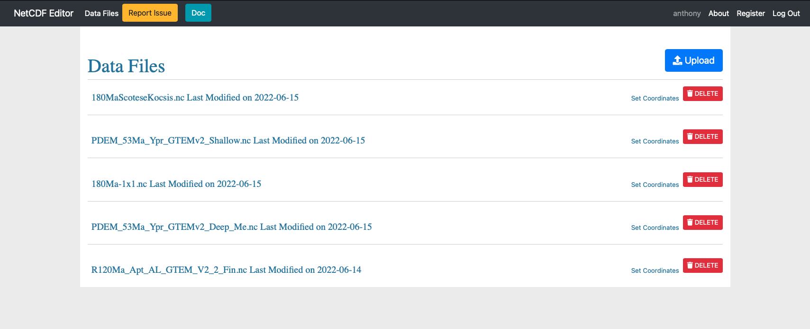

## Introduction
{:.no_toc}
As more and more tools were being added to the single page web app the workflow outgrew the scope of a single page web app. A full web app was built to handle this task.

### Preprocessing
{:.no_toc}
The Web tool allows a certain number of steps needed to create the boundary conditions for climate simulation models, notably IPSL.

## Table of Contents
{:.no_toc}
1. TOC
{:toc}

## Usage

We are greated with a login page. If this is the first time you are connecting (or the database has been reset) then you will first need to register (There are no constraints on username + password -> eg. you can write 1 letter usernames and passwords and also clobber previous entries). This step mainly exists to allow separating files based off from the UI in the future.

    

Once logged in we can see (all) files on the server that have already been added and also the possibility to upload a new file (top right). Files are order by last modified.

    

To upload a new file simply:
1. click the upload button
1. Choose the file
1. Click Submit
1. Set the longitude and latitude fields (used by several internal apps to get coordinates)

Once finished the file name should appear at the top of the list.

    

Inside a data file we can see it is separeted into two parts:
- Workflow
- Assets

### Workflow
The workflow has links through to the different steps that can be carried out. By default they have a <i class="fas fa-times-circle" style="color:#FF4136"></i> this means that the step is out of sync or has not been carried out.

When processing steps will have a <i class="fas fa-cog fa-spin" style="color:#377ba8"></i> and when completed a <i class="fas fa-check-square" style="color:#2ECC40"></i>. Note that if you update a prior step dependant steps are automatically carried out and the state is updated automatically, see image below. Certains steps notably [panel steps](#panel) can not be automatically updated and will be given a <i class="fas fa-times-circle" style="color:#FF4136"></i> to show they are no longer in sync.

    

##### Regrid
The regrid step allows to interpolate the uploaded topo/bathy data over a regular grid specified by the user (longitude/latitude steps and limits can be chosen). The interpolation method can also be selected among both **nearest neighbor** and **bilinear**.

##### Internal oceans

More details about how to [interact with data](/netcdf_editor_app/interact). (This concerns only [Internal Oceans](#internal-oceans), [Passage Problems](#passage-problems) and [Sub basins](#sub-basins) steps).

First figure is a representation of the data.

    

The next figure highlights the internal oceans (area of water surrounded by land) in red. The total is shown at the top right corner of the figure. They need to be removed for water mass conservation reasons that won't be satisfied in the model. There are two ways to perform this:
- either by creating an inlet linking the closed water area to the open ocean 
- or by replacing the closed water area by land points

    Land points are cells with value > 0  
    Water points are cells with value <= 0

    

The next figure depict the fact that:
- there cannot be water cells under 78°S (model won't compute thoses points)
- cells above 86°N should either be all land or all ocean

All the cells not matching these requirements will be highlighted in red. User must remove them.

    

Finally last figure is an histogram showing the topo/bathy value distribution.

    

##### Routing

At this step, user can choose an ORCA grid file to interpolate the original topo/bathy file on. User must ensure the 3 singular points of the grid are located on land area and not water because the high resolution would require a small Δt increasing computing time unnecessarily.

would require a small dt not relevant for the hydrodynamic processes solved by the model and increasing computing time.

The routing step will perform several actions:
- Interpolate data over model's grid (which is a coordinate file from a PALEORCA grid). Default one is `coordinates_paleorca2_40Ma.nc` but user can select his own.
- Compute routing
- Compute soils
- Compute ahmcoef
- Compute heatflow

##### Pft

User can generate a plant functional type file in this step by selecting percentages of each type in each ranges of latitude. Ranges can be added or removed.

##### Passage Problems

(See [interact with data](/netcdf_editor_app/interact) for more details).

This step allows to deal once again with internal oceans because of the [Routing](#routing) step that might have created new internal oceans with the interpolation process.

The next figure will highlight diffusive passages which are inlets of one water cell wide. Due to the way that the simulation code is written, water passages will only have diffusive properties and no advection, whilst this may be desired in certain locations this can be undesirable in certain areas (Strait of Gibraltar, Panama, ... ). The total is shown at the top right corner of the figure.

    Land points are cells with value = 0  
    Water points are cells with value > 0

    

Last figure is an histogram showing the bathymetry value distribution.

##### Sub basins

(See [interact with data](/netcdf_editor_app/interact) for more details).

In this step, the user can define 3 subbasins (3 values available 1, 2 and 3). The produced file will then useful for the model to process some average some variables by sub basin.

##### Calculate Weights

This last step allow the user to compute weights between ocean and atmosphere grids for flux transfers. [Mosaic](https://forge.ipsl.jussieu.fr/igcmg/browser/TOOLS/MOZAIC) and [Mosaix](https://forge.ipsl.jussieu.fr/igcmg/browser/TOOLS/MOSAIX) are the two methods available.

### Assets
The assets table show the currently available files. You can download them by clicking the download button. The view button will give a basic overview of the file. The complex viewer opens the panel app allowing you to change values inside the file. The Revision comparison does a diff and show this to the previous version of the same file.

    

