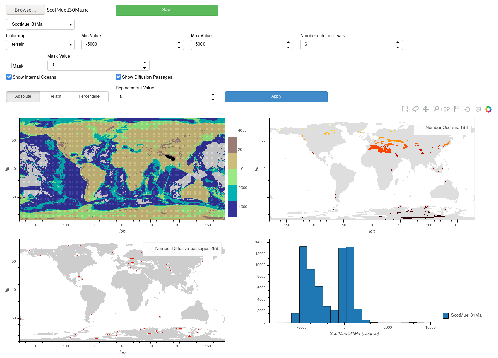
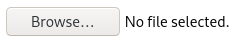
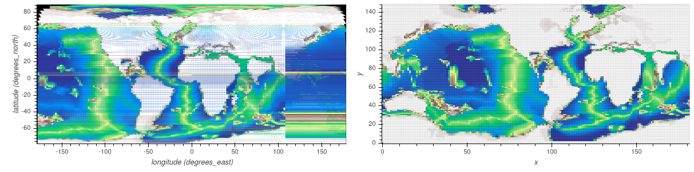
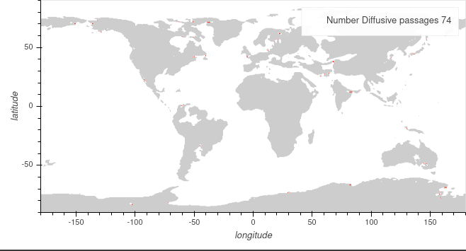
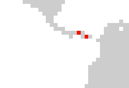
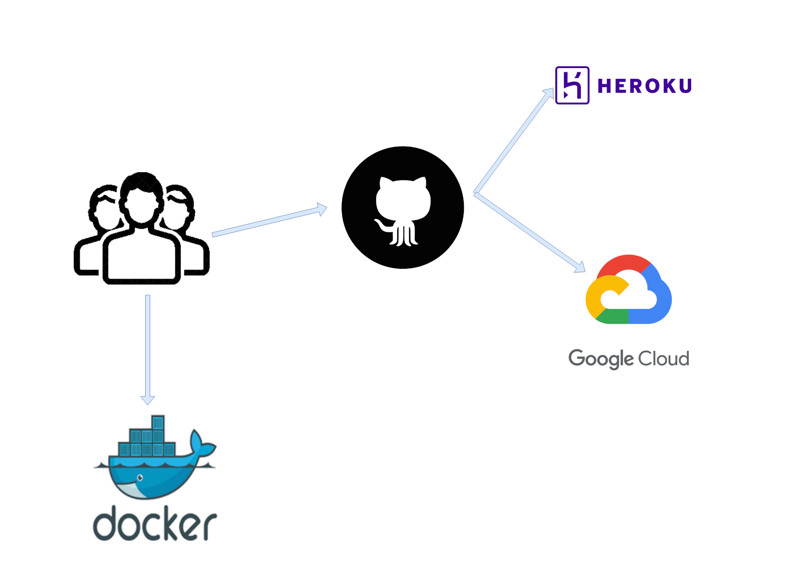

## Introduction
{:.no_toc}
The Sinlge Page web app is a panel web app that can be used to quickly modify values of a NETCdf file. It shows calculations of endoric basins (values below 0 surrounded by land values) and diffusive passages (see straights that are only 1 cell across).

You can choose the variable you visualize and the assocaited colormaps and steps.

Finally there are a number of methods to modify values and save then save the netcdf as either a `.nc` file or a python script to apply the same processing steps to other files.



## Table of Contents
{:.no_toc}
1. TOC
{:toc}

## Interface

### Browse

The entrypoint to the app is to upload a file using the available upload tool, seen below.



<p style="background-color: rgb(160, 194, 217);padding-left: 30px;">
Currently Google Cloud seems to only accept files less than roughly 20mb, however the limit for local deployement has been set to 100mb and is modifiable.
</p>

Under the hood the import and manipulation of the netCDF files is done by [xarray](https://xarray.pydata.org/en/stable/). 

```python
import xarray as xr
data = xr.open_dataset(FILENAME)
```

#### Curvilinear Coordinates

Curvilinear coordinates are supported __HOWEVER__ they are reprojected into _ij_ space. This is done because calculating selections on a non uniform grid is costly. Below the curvilinear grid is on the left, notice the areas in black that were not initially covered.



### Options

More details about how to [interact with data](/netcdf_editor_app/interact).

### Extra Maps


Finally we can choose to show extra maps. These carry out useful calculations to show locations that could cause a problem.

#### Internal Oceans

The simulation code has problems when internal oceans are present. Internal oceans are defined by values of 0 or less surrounded by values of land. By checking this option the backend will calculate in the current configuration the number of internal oceans and their locations.


#### Diffusive passages

Due to the way that the simulation code is written water passages (value of 0 or less) with a width of one cell will only have diffusive properties and no advection, whilst this may be desired in certain locations this can be undesirable in certain areas (Strait of Gibraltar, Panama, ... ). By checking this option the backend will calculate in the current configuration the number of diffusive oceanic cells and their locations.



<p align="center">
  
</p>

##### Theory

Convolutions were used to determine the diffusive passages.

The template that was used was the following and it's Transpose:

<table style="border: white;">
<tr style="border: white;">
    <td style="background-color: rgb(205, 205, 205);border: none;">?</td>
    <td style="background-color: rgb(160, 194, 217);border: none;">Water</td>
    <td style="background-color: rgb(205, 205, 205);border: none;">?</td>
    <td style="border: none;"></td>
    <td style="background-color: rgb(205, 205, 205);border: none;">0</td>
    <td style="background-color: rgb(160, 194, 217);border: none;">1</td>
    <td style="background-color: rgb(205, 205, 205);border: none;">0</td>
</tr>
<tr style="border: white;">
    <td style="background-color: rgb(171, 148, 114);border: none;">Land</td>
    <td style="background-color: rgb(160, 194, 217);border: none;">Water</td>
    <td style="background-color: rgb(171, 148, 114);border: none;">Land</td>
    <td style="border: none;"></td>
    <td style="background-color: rgb(171, 148, 114);border: none;">-1</td>
    <td style="background-color: rgb(160, 194, 217);border: none;">1</td>
    <td style="background-color: rgb(171, 148, 114);border: none;">-1</td>
</tr>
<tr style="border: white;">
    <td style="background-color: rgb(205, 205, 205);border: none;">?</td>
    <td style="background-color: rgb(160, 194, 217);border: none;">Water</td>
    <td style="background-color: rgb(205, 205, 205);border: none;">?</td>
    <td style="border: none;"></td>
    <td style="background-color: rgb(205, 205, 205);border: none;">0</td>
    <td style="background-color: rgb(160, 194, 217);border: none;">1</td>
    <td style="background-color: rgb(205, 205, 205);border: none;">0</td>
</tr>
</table>

A convolution works by passing a moving window over the underlying array and multiplying each value of the base array with the value in the template, it then calculates the sum and assigns it to the center cell. 

By coding in the template and the base array:
- Land -> -1 
- Ocean -> 1

It is possible to use 0 as values that we do not care about hence the templates above.

## Deployements

<!--  -->

### Local
The repository is setup to be able to run on local hardware (user's laptop or on premise cloud). You will need docker and docker-compose installed.

1. Clone this repository and check out the appropriate brach (unless reason to change you probably want main). `git clone https://github.com/CEREGE-CL/netcdf_editor_app.git`
1. Change into the directory `cd netcdf-editor-app`
1. Make sure it is up to date `git reset --hard @{u}` (resets to latest changes on repo)
1. Change intot the Single page web app directoy `cd Single_Page_WebApp`
1. Build the image `docker build -f single_page_webapp.Dockerfile -t netcdf_editor_single_page . --no-cache` (the `--no-cache` means everything gets rebuilt)
1. Start the container `docker run -d -p 8080:8080 netcdf_editor_single_page` (`-d` means detached mode so once the containers all start the command line is returned to you) the first 8080 after the `-p` is the port on the local machine you can change this to whatever you want, however do not change the second 8080 (without changing the Dockerfile first)
1. Connect to the container via [http://localhost:8080](http://localhost:8080)

 To run locally simply clone this repository and run:

<!-- ### Cloud

#### [Heroku](https://netcdf-editor-app.herokuapp.com)

[](https://netcdf-editor-app.herokuapp.com)

Heroku is a free service that is automatically deployed from the github repo when the `main` branch is updated. 

Being a free service ressource are limited and the app is laggy. This is maybe the best way to get a gist of what is happening but not useful for carrying out work. 

You can test the app [here](https://netcdf-editor-app.herokuapp.com)

#### [Google Cloud](https://netcdf-editor.ew.r.appspot.com/app)

We are testing using Google Cloud (Google App Engine) to build and run the App. In the same manner a trigger has been setup so that when `main` is updated a build and deployment occurs automatically.

Currently the App is running on free credits, however when these credits run out we have to decide if we carry on using this service or not.

You can test the app [here](https://netcdf-editor.ew.r.appspot.com/app) -->